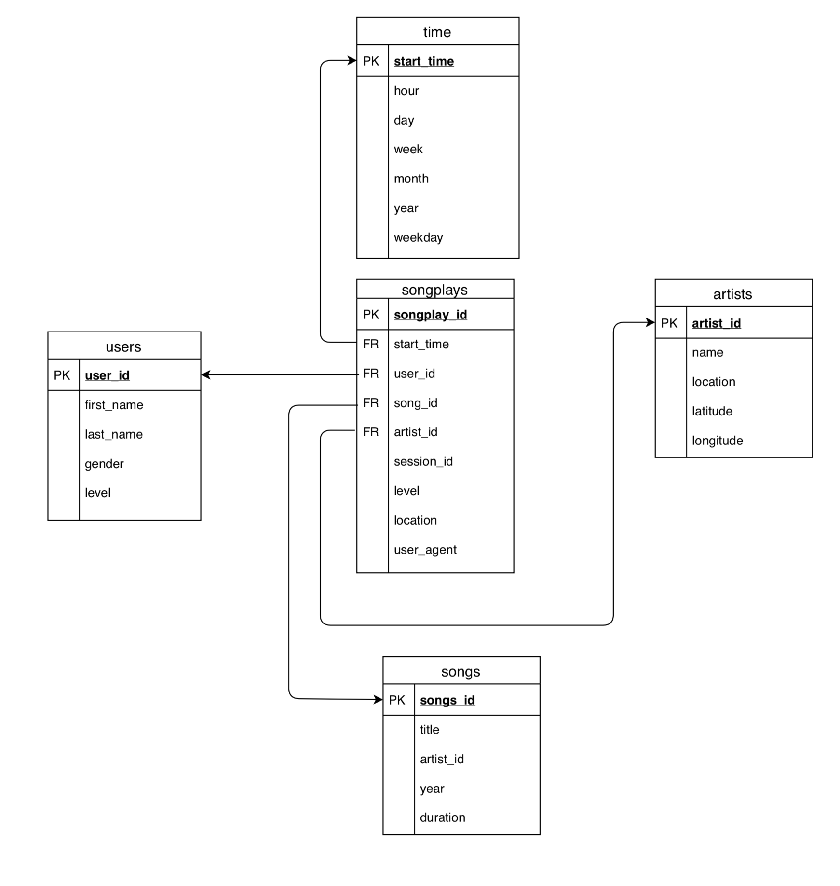

# Sparkify Project

The **purpose** of this analytic project is designed to members of analytical departament of sparkify. 

The goal is that this employees can understand how data flow in their domains. 
The data will be stored in databases to give the opportunity to apply stadistics for get conclusiones. 
The most played song or the less for example

## BBDD design

The database design is a star schema composed by fact table:
- songplay

And domain tables:
- users
- artists
- time 
- songs

> We provided a design of this database in pdf. This design can't was realized beacuse log file contains songs that the song file not contains and fail at do insert in songplays table but it was ideal. This table was referenced as songplaysfull in sql_queries.py but not implemented

In the process we control possible exceptions. In Jupyter notebook we clean data of nulls and duplicates to avoid exceptions on insert data. In the design of etl.py we decided to implement ON CONFLICT clauses for avoid exceptions that we have solved cleaning data previously.

## Schema Explanation

**Why star schema ?**

The reason to implement star schema is the possibility to access data of songs played bygetting the songsplay table and we can get all data referent of this song like artist name, song title, duration for example

## How to execute

- Run create_tables.py
- Run etl.py

Alternatively you can check if data is correct or debug process more specifically using jupyter notebooks 
elt.ipynb, test.ipynb
    
    
